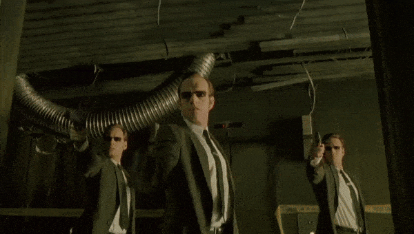

# Mr. Sum: Large-scale Video Summarization Dataset and Benchmark

Mr. Sum is a large-scale video summarization dataset, which contains 31,892 videos selected from YouTube-8M dataset and reliable frame importance score labels aggregated from 50,000+ users per video.  

<!--  -->


<!--  -->

<!-- **In this repository,**

1. We provide meta data and most replayed labels for 31,892 videos in [dataset](dataset) folder.

2. We provide Most replayed crawler enabling expansion of our dataset.

3. We provide sample codes to apply Mr.Sum dataset on a video summarization model. -->

## Most Replayed Statistics for Summarization

### Example 1: AC Sparta Praha - Top 10 goals, season 2013/2014

<p align="center">
  
</p>

| **<span style="color:yellow">1</span>** | **<span style="color:yellow">2</span>** | **<span style="color:yellow">3</span>** | **<span style="color:yellow">4</span>** |
| --- | --- | --- | --- |
|  |  |  |  |

The four most viewed scenes in the "AC Sparta Praha" video ([Link](https://youtu.be/hqm6r8xeAew)) all show players scoring goals. 

### Example 2: Best bicyle kick goals in Peru

<p align="center">
  
</p>

| **<span style="color:yellow">1</span>** | **<span style="color:yellow">2</span>** | **<span style="color:yellow">3</span>** | **<span style="color:yellow">4</span>** |
| --- | --- | --- | --- |
|  |  |  |  |

The four most viewed scenes in the above video all show players scoring goals with amazing bicycle kicks.([Link](https://youtu.be/q89vpZ1kwpM))

### Example 3: Neo - 'The One' | The Matrix

<p align="center">
  
</p>

| **<span style="color:yellow">1</span>** | **<span style="color:yellow">2</span>** | **<span style="color:yellow">3</span>** |
| --- | --- | --- |
|  |  |  |

The first most viewed scene, noted as 1 in the video, as soon as Neo meets Agent Smith, he is immediately shot by the gun. The second most viewed scene, noted as 2, plenty of Agent Smiths shoots Neo and Neo reaches out his hand to block the bullets. Lastly, in the most viewed scene 3, Neo engages in combat with Agent Smith. ([Link](https://www.youtube.com/watch?v=H-0RHqDWcJE))

### Update
- **2023.06.07**, Repository created.


----
## Getting Started

1. Download [YouTube-8M](https://research.google.com/youtube8m/) dataset.

2. Download [mrsum.h5](https://drive.google.com/file/d/1LmasS9joHe2VqINO2ZXLFdAE5nPdngyO/view?usp=sharing) and [metadata.csv](https://drive.google.com/file/d/1GhUSEzPif5h2sUtHsSK9zn4qlEqeKcgY/view?usp=sharing) place it under `dataset` folder.

<!-- 3. Install software packages.
    ```
    pip -r requirments.txt ??
    ```
. Now you are ready! -->

----
## Complete Mr.Sum Dataset

You need four fields on your `mrsum.h5` to prepare.

1. `features`: Video frame features from YouTube-8M dataset.
2. `gtscore`: Most replayed statistics normalized in 0 to 1 score.
3. `change_points`: Shot boundary information obtained using the  [Kernel Temporal Segmentation](https://github.com/TatsuyaShirakawa/KTS) algorithm.
4. `gtsummary`: Ground truth summary obtained by solving 0/1 knapsack algorithm on shots.

We provide three fields, `gtscore`, `change_points`, and `gtsummary`, inside `mrsum.h5`. 

After downloading YouTube-8M dataset, you can add the `features` field using
```
python preprocess/preprocess.py
```

Please read [DATASET.md](dataset/DATASET.md) for more details about the Mr.Sum.

----
## Apply Mr.Sum on your summarization model

We provide a sample code for training and evaluating summarization models on Mr.Sum.

A summarization model developer can test their own model by implementing pytorch models under the `model/networks` folder.

We provide the [`SimpleMLP`](model/networks/mlp.py) summarization model as an example.

You can train your model on Mr.Sum dataset using the command below. Modify configurations with your taste!
```
python main.py --train True --batch_size 8 --epochs 50 --tag exp1
```

We referred the code from [PGL-SUM](https://github.com/e-apostolidis/PGL-SUM).

----

## License
This dataset is licensed under [Creative Commons Attribution 4.0 International (CC BY 4.0) license](https://creativecommons.org/licenses/by/4.0/) following the YouTube-8M dataset. All the Mr.Sum dataset users must comply with [YouTube Terms of Service](https://www.youtube.com/static?template=terms) and [YouTube API Services Terms of Service](https://developers.google.com/youtube/terms/api-services-terms-of-service#agreement).

----
